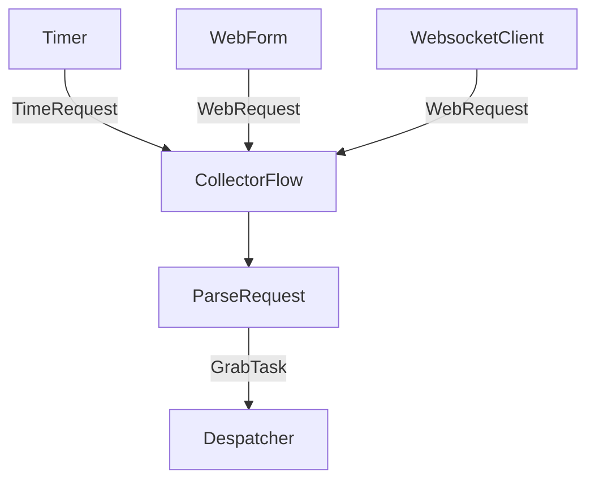

# Collector Design

## 搜集器

搜集器是一个子服务，负责主动发现/被动接收抓取请求，将抓取请求打包分发给调度器进行处理；

## WebRequest

Name | Type | Description | Default
-----|------|-------------|--------
`url` | string | 请求的url 
`method` | string | 请求的方法，支持GET、POST、PUT、DELETE、HEAD、OPTIONS、PATCH | GET
`headers` | dict | 请求的headers | None
`body` | dict | 请求的body，根据 `headers` 的 `Content-Type` 来编码 默认使用 json `'Content-Type: application/json'`进行编码 | None
`cookies` | dict | 请求的cookies, key为domain，value为cookie字符串 | None
`metadata` | dict | 请求的附加元数据 | None

## TimeRequest

Name | Type | Description | Default
-----|------|-------------|--------
`request` | WebRequest | 请求的内容
`time` | datetime | 本次调度的时间
`schedule` | string | 调度器的安排 | 'Now'