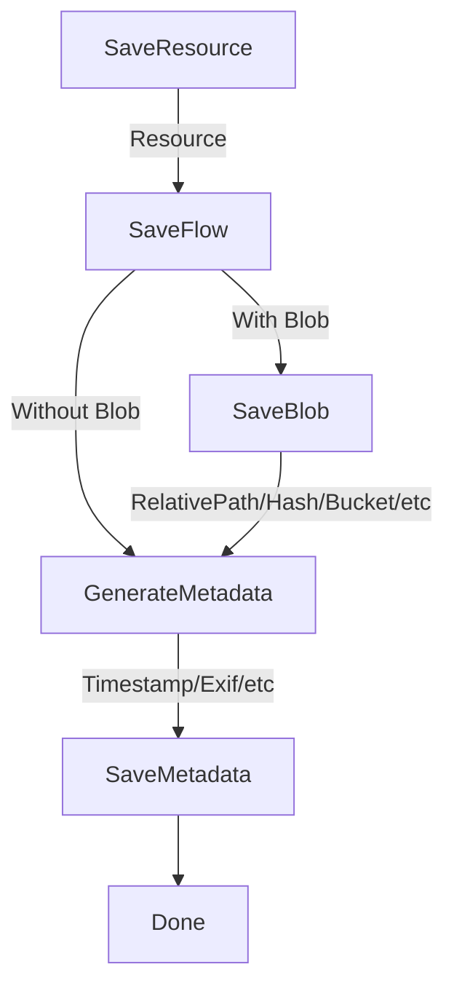
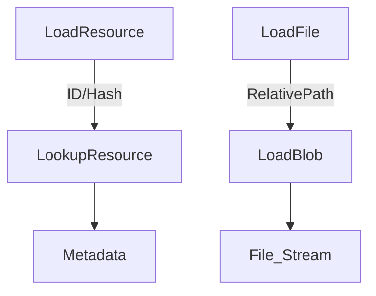

# Storage Design


```
+----------------+     +----------+     +------------------+
| Input Resource | --> | Metadata | --> | Metadata Storage |
+----------------+     +----------+     +------------------+
                            |    +-----------------+     +--------------+
                            +--> | Blob (FileLike) | --> | Blob Storage |
                                 +-----------------+     +--------------+
```


## Save Resource Flow



## Load Resource Flow

