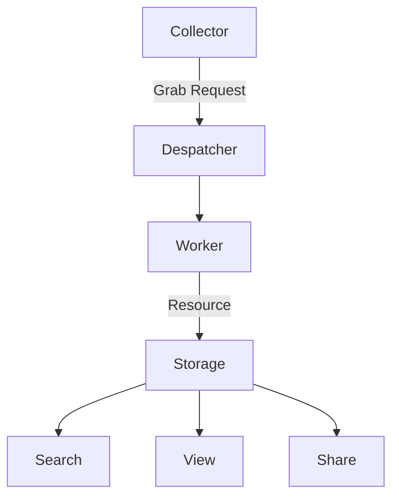

# 系统设计

仓鼠病工具集合基本工作流程：

其中各个子模块都是可以通过插件进行扩展的。而另外一些比如定时调度器则作为基础模块存在；

## 各个子模块的设计

* Collector 是一个子服务，会主动搜集元数据 或者 被动接收请求，将其搜集到的元数据包装为 Grab Request 送到调度器 Despatcher；
* Despatcher 是一个调度器，会接收 Grab Request，并将其分发给各个 Worker，同时监视任务进度；
* Worker 负责将 Grab Request 转换为 Resource，并将 Resource 存储到 Storage；
* Storage 负责将 Resource 存储到磁盘；并根据配置将 Metadata 分离保存到全文检索/数据库中；
* View 负责将 Resource 渲染成 HTML/JSON；
* Search 负责从 全文检索/数据库中 根据输入匹配出结果；

* Grab Request 是一个数据结构，包含了数据的元数据，例如数据的类型、数据的来源、数据的接收方式等；
* Resource(s) 是系统最终存储的资源文件，包含了 media 和 metadata；

## 搜集器

搜集器分为主动和被动两种模式：

* 主动式搜集器： 根据配置的规则，自动进行搜集，刮削，生成 Grab Request；
* 被动搜集器： 监听请求，刮削自身能处理的 Metadata 并生成 Grab Request；

## 调度器

调度器负责

* 对请求的 Grab Request 进行去重处理；
* 将搜到的 Grab Request 分派给不同的 Worker， 同时，监视其工作进度；
* 对于已经出错的 Grab Request，根据策略将其重新放回队列或者暂停/延缓执行；
* 对于有定时要求的任务，在请求时间根据配置触发任务；

## Worker

Worker 是整个搜集工作流的中心

* 负责进行实际资源获取；
* 负责提取资源的 Metadata；
* 负责解析 Metadata 后对可能出现的资源再次生成 Grab Request；
* 负责将最终获取到的资源存储到 Storage；

## 存储

Storage 负责将资源存储到磁盘；同时，根据配置，将 Metadata 分离保存到全文检索/数据库中；

## 默认视图

一个典型的渲染器，可以提取 Resource 的 Metadata，并将其转换为 HTML/JSON 呈现给用户；

## 搜索

使用全文检索/数据库对 Metadata 进行搜索；

## 分享

TBD.