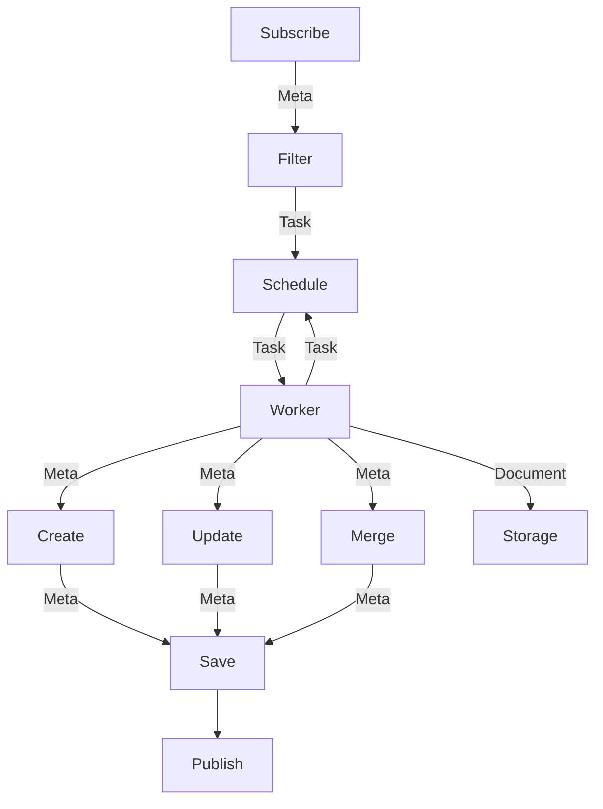

# 系统设计

## Data Flow

## Meta & Document

1. Meta&Document 是系统管理的原子数据；
1. Meta 是一个经过各个 Worker 处理后，可以检索的 Key/Value 字典；
1. Document 是原始获取的内容（文本/媒体/等）；
2. 每个 Document 必然有至少一个对应的 Meta 数据来描述其内容摘要；
3. Meta 可以引用其它 Meta 来描述其关联的内容；

## Task & Schedule

1. Task 是 Worker 处理的最小事务；Task 主要参数： Worker(Group)/Meta ID(Nullable)/Task Name(Route)/Task Params（使用二进制方式存储，并按照原始内容传递）；
2. Task 可以从 Meta Insert/Update/Select 等操作中生成；其中 Meta Insert/Update 会通过消息管线实时广播，而 Meta Select 可以通过 API 查询后批量处理；
3. Schedule 可以通过排期生成对应 Task；

## Worker & Group

1. 一个 Worker 代表一个实际进行 Meta 相关 Document获取/解析/筛选 等事务的进程/线程；